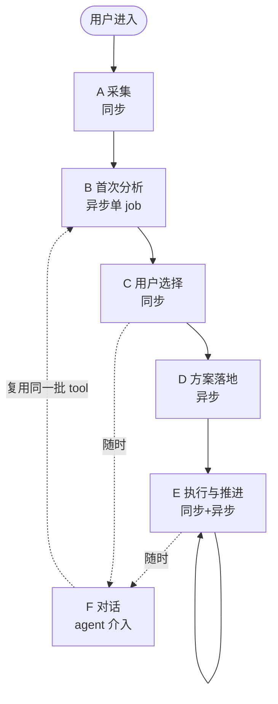
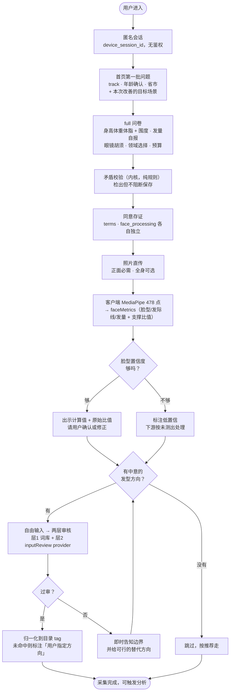
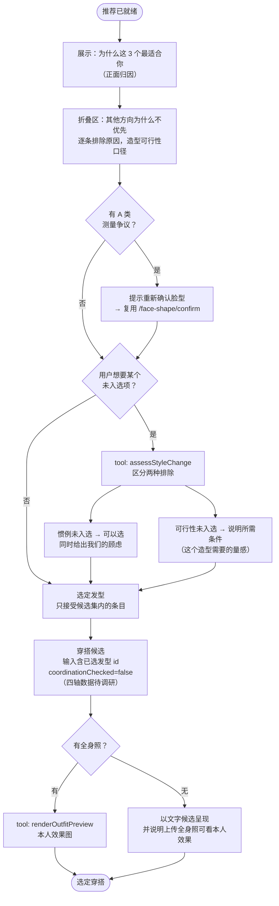
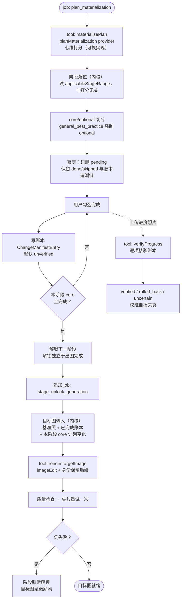
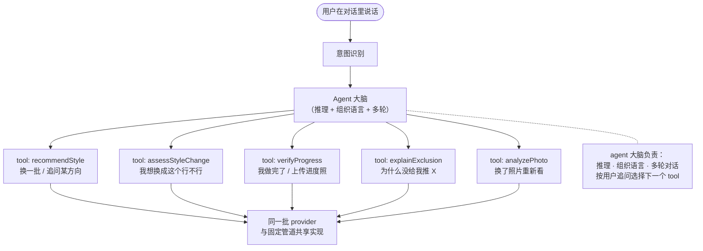
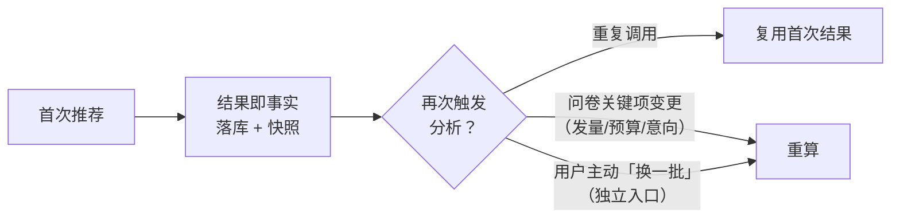

# 目标设计：业务流程与 tool 调用路径

**这份文档描述的是设计目标，不是当前实现。** 现状见文末对照表。

⚠ 推荐环节（§2 的 B5-B7）以 `specs/pluggable-style-recommendation.md` 为准。
回答一个问题：用户进来之后，系统按什么顺序做判断、每一步调用哪个 tool。

---

## 0. 三条贯穿全局的设计原则

先说原则，因为下面每个分支都是它们的推论。

**① tool 承载判断，数据装配成输入。**
tool 的职责是返回业务结论加依据。天气、用户画像、打理教程这类上下文数据，
在调用前装配进输入——推荐发生时它们已经在场，agent 拿到的每一项都已经是结论。

**② 依据可争议的做成接缝，我们定的规则做成内核。**
审美偏好、优先级排序、值不值得做 —— 这些会被更好的实现取代，做成可替换的 provider。
物理可行性、合规要求、安全边界 —— 由代码确定执行。

**③ 候选集由主线产生，由复核收窄。**
复核的作用是从候选集里剔除，剔除后由排序中的下一名补位。
这样最坏情况是少推一个好选项，而硬约束的保护始终成立。

---

## 1. 主流程总览

阶段之间刻意用**用户的同步选择**切开（C 在 B 与 D 之间）。
理由是流程中有两次必须等用户拍板的地方（选发型、选穿搭），物理上不可能连续执行完。
这也顺带把图片生成压力分散到用户的思考时间里。

### 1.1 阶段 A 展开：采集

这一段几乎没有 tool 调用，唯一的例外是意向审核 —— 而它的位置是个刻意设计。

**为什么审核要做两次**（这里一次，B1 又一次）：

- **同步这次给即时反馈**。用户填完意向当场就知道能不能做，还在输入状态里就能改；
  等到分析跑完再告诉他，他已经在等结果了。
- **异步那次让安全边界自成立**。同步入口的结论落在库里，管道自己再校验一遍，
  边界由管道自身保证，与调用方走了哪个入口无关。

### 采集目标：我们要哪些数据，各自驱动什么

每一项都写明消费者。**清单之外的即不需要采集**——不另列排除项。

**身体数据 → 穿搭版型与体型判断**
- 身高、体重、体脂率
- 围度：肩宽、胸围、腰围、腿围 → 决定版型方向（宽肩窄腰走修身，其余走直筒）
- 常健身 → 健身类任务的可行性与时间尺度

**外观事实 → 发型与仪容**
- 客户端 478 点几何：脸型 + 发际线 + 发量，含支撑比值与置信度（脸型的权威来源）
- 用户确认或修正的脸型（优先于计算值）
- 自报发量 + 脱发困扰 → 发际线被遮挡时，这是可行性约束唯一的信号来源
- 眼镜、胡须 → 发型搭配与仪容领域任务

**目标与偏好 → 方案方向与节奏**
- 目标场景 + 日期（来自第一幕场景意图题）→ 正式度目标值 + 阶段时间窗口
- 现状满意度 / 改变意愿（来自 satisfaction 页的四档）→ 方案节奏：
  「很不满意、想尽快改变」把快见效的动作排前，「一般、有提升空间」可以更从容。
  这与 `track` 不重叠——`track` 问的是有没有具体场合，这一项问的是改变意愿强度
- 领域选择 + 各领域接受度 → 决定 S5 落哪些领域的任务，以及打分里的 acceptance 轴
- 预算档 → 成本可承受度
- 发型意向文本（过两层审核后）→ 用户指定方向分支

**合规与上下文**
- 出生日期 + 18 岁确认
- 省市 → 天气与季节上下文
- 三类同意记录（条款 / 人脸处理 / 训练），各自独立可撤回

**效果回收（方案执行一段之后，另一个时间点）**
- 有用程度、自信心变化、实际完成了哪些、文字反馈
- 用途：校准审美匹配与打分公式。这是"我们猜得对不对"唯一的真实反馈来源

**为什么脸型要用户确认**：几何测量给的是分类 + 置信度 + 支撑比值。
出示比值（"你的脸宽/脸长 = 0.92"）比只说结论可信得多，
而用户的修正值在所有下游过滤中优先于计算值——他比我们更清楚自己的脸。

---

---

## 2. 阶段 B：首次分析的完整调用路径

这是整个系统的核心。**看这张图就知道什么时候调什么。**

```mermaid
flowchart TD
  J([job: initial_analysis]) --> B1

  B1["tool: moderateInput<br/>三层输入审核"]
  B1 --> B1a{"层1 词库共现<br/>命中红线？"}
  B1a -->|是| FAIL1([终止：越界请求]):::stop
  B1a -->|否| B1b["层2 inputReview provider<br/>LLM 判灰区"]
  B1b --> B1c["层3 图片审核 provider<br/>内容安全"]
  B1c --> B1d{"任一层 blocked？"}
  B1d -->|是| FAIL1
  B1d -->|否| B2

  B2["tool: analyzePhoto<br/>vision provider"]
  B2 --> B2a["输出：当前发型 / 发际线可见性<br/>胡须 / 眼镜 / 肤色 / 当前穿着"]
  B2a --> B2b{"发际线<br/>occluded？"}
  B2b -->|是| B2c["云端兜底判定<br/>+ 自报数据补位"]
  B2b -->|否| B3
  B2c --> B3
  note1["几何来自客户端 478 点测量<br/>云端负责语义特征：<br/>发型·发际线可见性·胡须·眼镜·肤色·穿着"]
  B2 -.- note1

  B3["建方案（内核）<br/>generationSeed 固定 + 四阶段骨架"]
  B3 --> B4

  B4["上下文装配（内核）<br/>省市 → 天气/季节 · 目标场景<br/>身体数据 · 意向"]
  B4 --> B5

  B5["RecommendationApplication<br/>唯一对外入口"]
  B5 --> B5a["① 计算 computationKey<br/>planId + kind + generation + 指纹"]
  B5a --> B5b{"原子 insert-or-get<br/>RecommendationSet(preparing)"}
  B5b -->|"已存在（跟随者）"| B5c["读取该集合<br/>不调用 provider"]
  B5b -->|"创建成功（创建者）"| B6

  B6["② 目录预过滤（应用模块）<br/>按发量·发际线信号取 eligibleVariants"]
  B6 --> B6a{"可行集合<br/>为空？"}
  B6a -->|"是"| B6b["返回零候选并说明约束<br/>不放宽约束"]
  B6a -->|"否"| B6c["③ 账本写 prepared<br/>（提交供应商之前）"]

  B6c --> B7["④ provider 在 eligibleVariants 内<br/>选择与排序，产出 modelRationale"]
  B7 --> B7a["⑤ 输出校验（应用模块）<br/>归属·去重·rank 连续·数量·长度"]
  B7a --> B7b["⑥ 客观属性从目录读<br/>渲染指令由模板 + variantId 构建"]
  B7b --> B7c["⑦ 候选写入 + set → ready<br/>同一事务"]
  B7c --> B8
  B5c --> B8
  note2["付费恢复语义：火山无供应商侧幂等<br/>过期 prepared 转 unknown<br/>不自动重提，走对账"]
  B6c -.- note2

  B8["tool: renderPreview<br/>imageEdit provider（串行）"]
  B8 --> B8a["Redis 信号量持槽<br/>覆盖整个 submit→poll"]
  B8a --> B8b["按匹配度降序提交<br/>（并发=1 下完成顺序=提交顺序）"]
  B8b --> B8c["内核统一追加身份保留后缀"]
  B8c --> B8d["逐张写回 partialResult<br/>客户端增量渲染"]
  B8d --> B9

  B9["快照落库（内核）<br/>推荐 + 注入的天气 context + 全量判定<br/>可按地区 × 季节检索"]
  B9 --> Done([文字推荐先到<br/>图片逐张追加])

  classDef stop fill:#fee,stroke:#c33
```

### 为什么是这个顺序

| 位置 | 设计理由 |
|---|---|
| 审核在最前 | 层1 是确定性词库，由代码保证；通过后才值得花 LLM 判灰区 |
| 建方案在 B3 而非路由里 | `generationSeed` 建方案时一次定死并全阶段复用，四阶段图像才是同一个人的递进 |
| 天气在 B4 装配 | 它是上下文数据。装配进输入，推荐发生时天气已经在场 |
| 抢占在付费调用**之前** | 否则两个并发请求同时查不到就绪集合、同时调付费 provider，最后才竞争唯一键——库里只留一个集合而钱花了两次 |
| 预过滤在 provider **之前** | provider 可能只挑中不可行项；若改为生成后过滤会得到零候选，而目录里存在可行方向 |
| 属性与指令由服务端持有 | 属性取自目录带不可变 revision；指令由模板构建，避免可替换 adapter 获得改动身份与体型的通道 |
| 快照在最后 | 天气走 prompt 注入，快照让每条推荐事后可解释：当时推这个，依据是哪份 context |

---

## 3. 阶段 C：用户选择

**关键设计**：惯例与可行性走两条处置路径。
脸型适配是审美惯例，用户可以选中它并同时看到我们的顾虑；
发量支撑是物理可行性，由代码保证——未满足时说明这个造型需要什么条件。

---

## 4. 阶段 D-E：落地与推进

**目标图只含 core**：core 集合同时定义解锁条件与图片内容，两者一致，
用户看到的图与他做过的事对得上。
**目标图的输入恒为最初的基准照片**：每一阶段都从原图出发，四阶段之后仍然是本人。

---

## 5. 阶段 F：agent 在哪里介入

**核心设计**：agent 能做的每件事都对应管道里已存在的一个能力，
两个入口共享一份实现，对话与管道给出同一个结论。

**agent 拿到的每一项都是后端已经判断完的结论 + 依据。**
tool 的返回值是「结论 + 为什么」。

---

## 6. 幂等与可复现

确定性匹配天然幂等；LLM 实现的幂等由这一层设计保证。

这样用户第二次进来看到的还是同一批推荐，上次看中的那个还在。

---

## 7. 完整 tool 清单

| tool | 背后 provider | 可换实现 | 内核部分（代码保证） |
|---|---|---|---|
| `moderateInput` | inputReview + 图片审核 | LLM 审核可换 | **层1 词库共现判定** |
| `analyzePhoto` | vision | 多家可换 | 几何来自客户端，云端不判几何 |
| `recommendStyle` | styleRecommendation | vision-llm ↔ catalog-matching | **可行性校验在外层** |
| `renderPreview` / `renderTargetImage` | imageEdit / clothingSwap | 多家可换 | **身份保留后缀 + 并发信号量** |
| `materializePlan` | planMaterialization | rule-based ↔ LLM | **阶段落位 + 证据门槛** |
| `assessStyleChange` | styleChangeAssessment | 可换 | **头发长度物理约束** |
| `verifyProgress` | vision | 可换 | **账本状态机** |
| `explainExclusion` | 无（读全量判定记录） | — | 全部 |

**装配成调用输入的**：天气/季节/地区、用户画像、打理教程。

---

## 8. 现状对照

| 设计项 | 现状 |
|---|---|
| B1 层1 词库 + 层2 LLM | ✅ 已实现 |
| B1 层3 图片审核 | ⬜ provider 未选（本地 MVP 搁置） |
| B2 analyzePhoto | ✅ 已实现；语义输出的解析与消费 ⬜ |
| B4 天气装配 | ⬜ 服务已实现但未接进推荐路径 |
| B5 recommendStyle 接缝 | ✅ 接口 + vision-llm 实现；catalog-matching ⬜ |
| B5 全量判定记录 | ⬜ 现在只有计数式 filterTrace |
| B6 可行性校验 | ✅ 已实现；**客观造型属性表 ⬜（实测发现模型标注会朝「能通过」方向偏）** |
| B7 对抗式复核 | 🔶 step 与 provider 已写，未接进编排器 |
| B8 renderPreview | ✅ 已实现；**预览图未追加身份保留后缀 ⬜** |
| B9 快照落库 | ⬜ |
| C3 惯例/可行性排除区分 | ⬜ 现在两者都是硬排除 |
| D2 materializePlan 接缝 | ✅ 刚抽出 |
| E1-E13 推进与复核 | ✅ 已实现 |
| F agent 介入 | ⬜ tool 包装未做；对话入口用确定性意图分类，未接 agent |
| 幂等设计 | ⬜ |
| 审美数据本体 | ⬜ 空，跑测试占位 11 条 |
