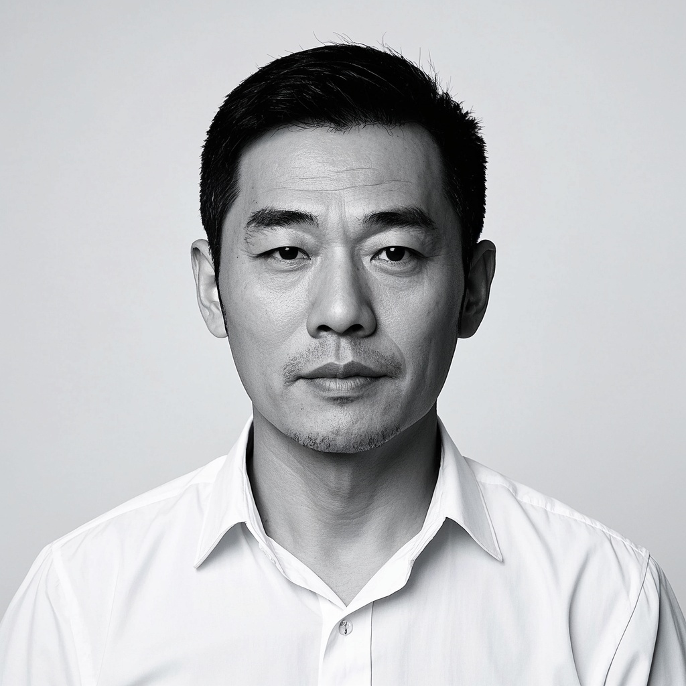
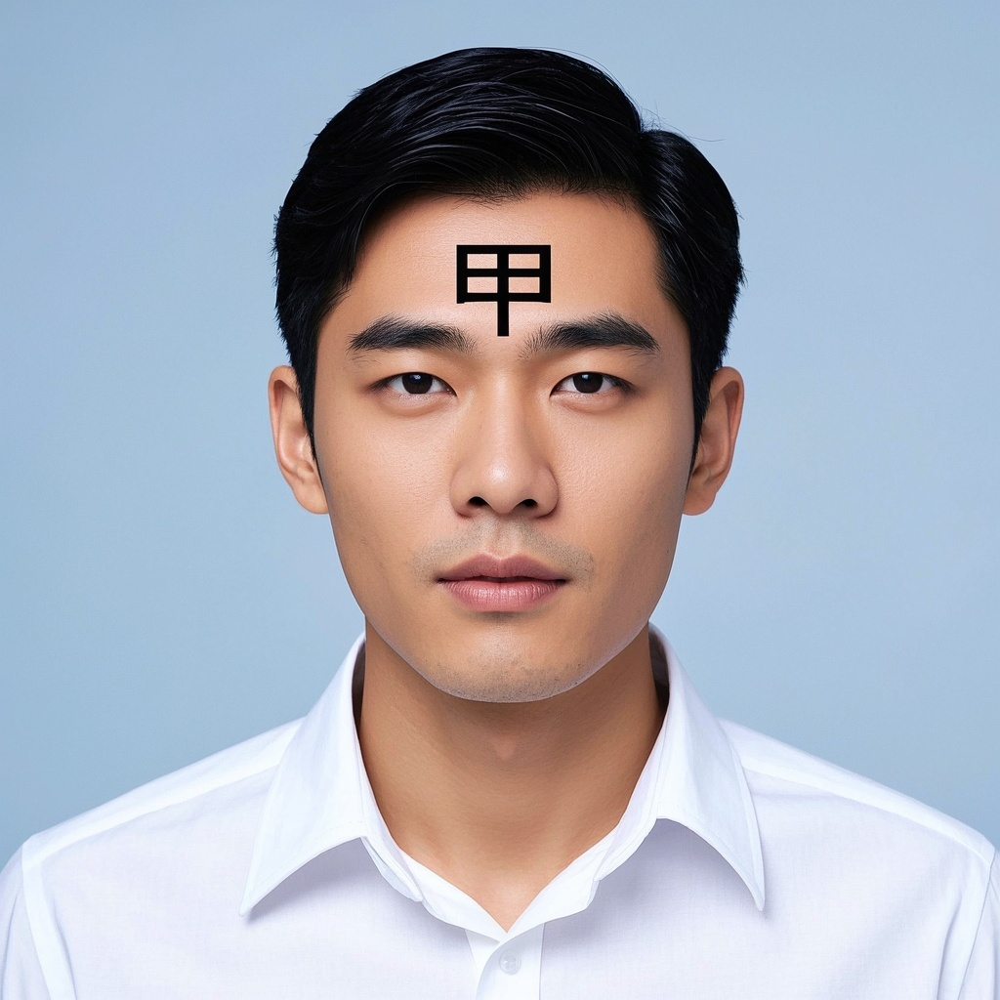

# Vision Provider Comparison

Prompt used for all providers:

```
请分析这张照片中人物的脸型、发型、发际线状态、是否有胡须、是否戴眼镜。只输出结构化JSON，字段包括 face_shape, hairstyle, hairline, facial_hair, glasses, estimated_age_range。不要做医学诊断，不要评判性描述。
```

## 01-round


### zhipu-glm-4v (glm-4v-flash, 2962ms)

```
```json

{
    "face_shape": "菱形",
    "hairstyle": "短发",
    "hairline": "后移",
    "facial_hair": "无",
    "glasses": "否",
    "estimated_age_range": "30-40岁"
}

```
```

### qwen-vl (qwen-vl-plus, 2321ms)

```
```json
{
  "face_shape": "椭圆形",
  "hairstyle": "短发，向后梳理",
  "hairline": "正常",
  "facial_hair": "有轻微胡须",
  "glasses": false,
  "estimated_age_range": "25-35"
}
```
```

### hunyuan-vision — FAILED

```
Incorrect API key provided: sk-c1UFS************************************REL6mKD. You can find your API key at https://console.cloud.tencent.com/hunyuan/start.
```

## 02-square


### zhipu-glm-4v (glm-4v-flash, 2062ms)

```
```json

{
    "face_shape": "方形",
    "hairstyle": "短发",
    "hairline": "后移",
    "facial_hair": "无",
    "glasses": "未佩戴",
    "estimated_age_range": "40-50岁"
}

```
```

### qwen-vl (qwen-vl-plus, 1629ms)

```
```json
{
  "face_shape": "方形",
  "hairstyle": "短发，剃得很短",
  "hairline": "后退",
  "facial_hair": "有胡须，主要是下巴和脸颊的短胡须",
  "glasses": false,
  "estimated_age_range": "40-50"
}
```
```

### hunyuan-vision — FAILED

```
Incorrect API key provided: sk-c1UFS************************************REL6mKD. You can find your API key at https://console.cloud.tencent.com/hunyuan/start.
```

## 03-long


### zhipu-glm-4v (glm-4v-flash, 2393ms)

```
```json

{
    "face_shape": "菱形",
    "hairstyle": "短发",
    "hairline": "后移",
    "facial_hair": "有胡渣",
    "glasses": "无",
    "estimated_age_range": "30-40岁"
}

```
```

### qwen-vl (qwen-vl-plus, 1649ms)

```
```json
{
  "face_shape": "椭圆形",
  "hairstyle": "短发，向后梳理",
  "hairline": "正常，无明显后退",
  "facial_hair": "有轻微胡须",
  "glasses": false,
  "estimated_age_range": "35-45"
}
```
```

### hunyuan-vision — FAILED

```
Incorrect API key provided: sk-c1UFS************************************REL6mKD. You can find your API key at https://console.cloud.tencent.com/hunyuan/start.
```

## 04-oval


### zhipu-glm-4v (glm-4v-flash, 2469ms)

```
```json

{
    "face_shape": "无法确定",
    "hairstyle": "短发，向后梳理",
    "hairline": "高",
    "facial_hair": "无",
    "glasses": "否",
    "estimated_age_range": "20-30岁"
}

```
```

### qwen-vl (qwen-vl-plus, 1679ms)

```
```json
{
  "face_shape": "心形",
  "hairstyle": "短发，向后梳理",
  "hairline": "自然，无明显后退",
  "facial_hair": "无",
  "glasses": "无",
  "estimated_age_range": "20-30"
}
```
```

### hunyuan-vision — FAILED

```
Incorrect API key provided: sk-c1UFS************************************REL6mKD. You can find your API key at https://console.cloud.tencent.com/hunyuan/start.
```

## 05-guozi


### zhipu-glm-4v (glm-4v-flash, 2187ms)

```
```json

{
    "face_shape": "国字脸",
    "hairstyle": "黑色短发，向后梳理",
    "hairline": "后移的发际线",
    "facial_hair": "有胡子",
    "glasses": "无",
    "estimated_age_range": "60-70岁"
}

```
```

### qwen-vl (qwen-vl-plus, 1669ms)

```
```json
{
  "face_shape": "椭圆形",
  "hairstyle": "短发，向后梳理",
  "hairline": "后退",
  "facial_hair": "有胡须和山羊胡",
  "glasses": false,
  "estimated_age_range": "60-70"
}
```
```

### hunyuan-vision — FAILED

```
Incorrect API key provided: sk-c1UFS************************************REL6mKD. You can find your API key at https://console.cloud.tencent.com/hunyuan/start.
```

## 06-youzi



### zhipu-glm-4v (glm-4v-flash, 1942ms)

```
```json

{
    "face_shape": "椭圆形",
    "hairstyle": "短发",
    "hairline": "后移",
    "facial_hair": "有胡茬",
    "glasses": "无",
    "estimated_age_range": "40-50岁"
}

```
```

### qwen-vl (qwen-vl-plus, 1604ms)

```
```json
{
  "face_shape": "方形",
  "hairstyle": "短发，向后梳理",
  "hairline": "正常，无明显后退",
  "facial_hair": "有轻微胡须",
  "glasses": false,
  "estimated_age_range": "40-50"
}
```
```

### hunyuan-vision — FAILED

```
Incorrect API key provided: sk-c1UFS************************************REL6mKD. You can find your API key at https://console.cloud.tencent.com/hunyuan/start.
```

## 07-jiazi



### zhipu-glm-4v (glm-4v-flash, 2175ms)

```
```json

{
    "face_shape": "无法确定",
    "hairstyle": "短发",
    "hairline": "正常",
    "facial_hair": "无",
    "glasses": "未佩戴",
    "estimated_age_range": "30-40岁"
}

```
```

### qwen-vl (qwen-vl-plus, 1524ms)

```
```json
{
  "face_shape": "心形",
  "hairstyle": "短发，向后梳理",
  "hairline": "正常，无明显后退",
  "facial_hair": "无",
  "glasses": "无",
  "estimated_age_range": "25-35"
}
```
```

### hunyuan-vision — FAILED

```
Incorrect API key provided: sk-c1UFS************************************REL6mKD. You can find your API key at https://console.cloud.tencent.com/hunyuan/start.
```

## 08-glasses


### zhipu-glm-4v (glm-4v-flash, 2570ms)

```
```json

{
    "face_shape": "方形",
    "hairstyle": "短发",
    "hairline": "后移",
    "facial_hair": "无",
    "glasses": "是",
    "estimated_age_range": "60-69岁"
}

```
```

### qwen-vl (qwen-vl-plus, 1814ms)

```
```json
{
  "face_shape": "椭圆形",
  "hairstyle": "短发，后部和两侧较短，顶部略长，有灰白发",
  "hairline": "后退，可见少量头顶头发",
  "facial_hair": "无",
  "glasses": "有，黑色框架眼镜",
  "estimated_age_range": "60-75"
}
```
```

### hunyuan-vision — FAILED

```
Incorrect API key provided: sk-c1UFS************************************REL6mKD. You can find your API key at https://console.cloud.tencent.com/hunyuan/start.
```

## 09-beard


### zhipu-glm-4v (glm-4v-flash, 3070ms)

```
```json

{
    "face_shape": "菱形",
    "hairstyle": "短发",
    "hairline": "后移",
    "facial_hair": "有胡子",
    "glasses": "无",
    "estimated_age_range": "45-55岁"
}

```
```

### qwen-vl (qwen-vl-plus, 1771ms)

```
```json
{
  "face_shape": "椭圆形",
  "hairstyle": "短发，向后梳理",
  "hairline": "发际线正常，无明显后移",
  "facial_hair": "有胡须，包括山羊胡和下巴胡",
  "glasses": false,
  "estimated_age_range": "50-60"
}
```
```

### hunyuan-vision — FAILED

```
Incorrect API key provided: sk-c1UFS************************************REL6mKD. You can find your API key at https://console.cloud.tencent.com/hunyuan/start.
```

## 10-receding


### zhipu-glm-4v (glm-4v-flash, 1938ms)

```
```json

{
    "face_shape": "椭圆形",
    "hairstyle": "短发",
    "hairline": "后移",
    "facial_hair": "有胡子",
    "glasses": "无",
    "estimated_age_range": "60-70岁"
}

```
```

### qwen-vl (qwen-vl-plus, 1714ms)

```
```json
{
  "face_shape": "椭圆形",
  "hairstyle": "短发，灰白色，向后梳理",
  "hairline": "发际线略高，有轻微后移",
  "facial_hair": "有胡须，主要集中在下巴和嘴唇周围",
  "glasses": false,
  "estimated_age_range": "70-80"
}
```
```

### hunyuan-vision — FAILED

```
Incorrect API key provided: sk-c1UFS************************************REL6mKD. You can find your API key at https://console.cloud.tencent.com/hunyuan/start.
```
